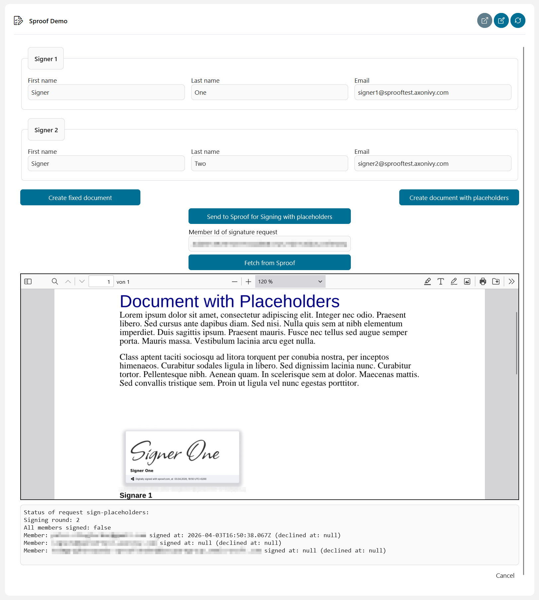
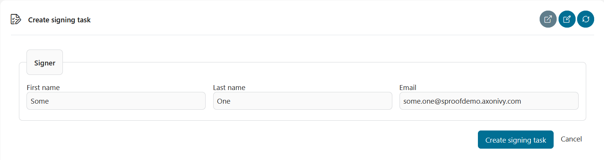
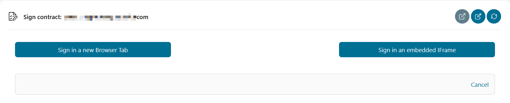
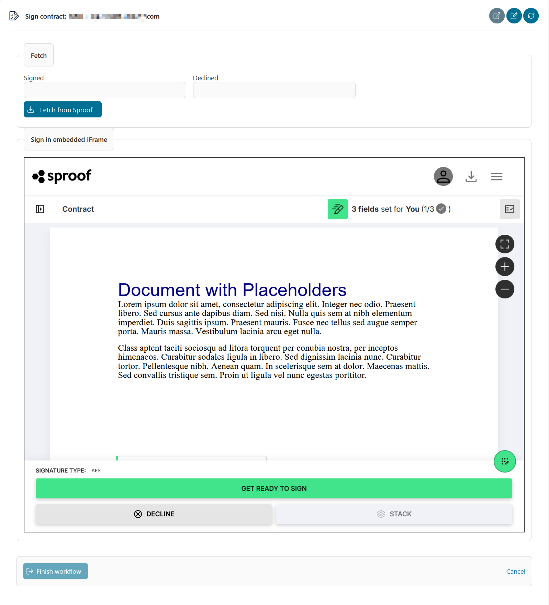
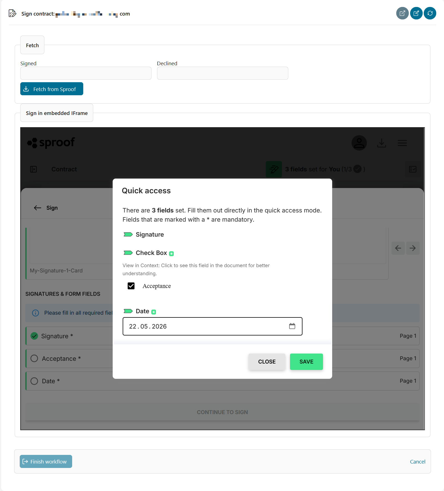
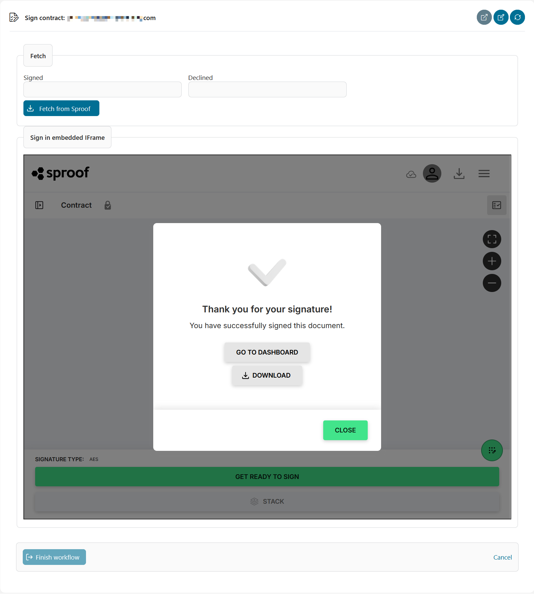
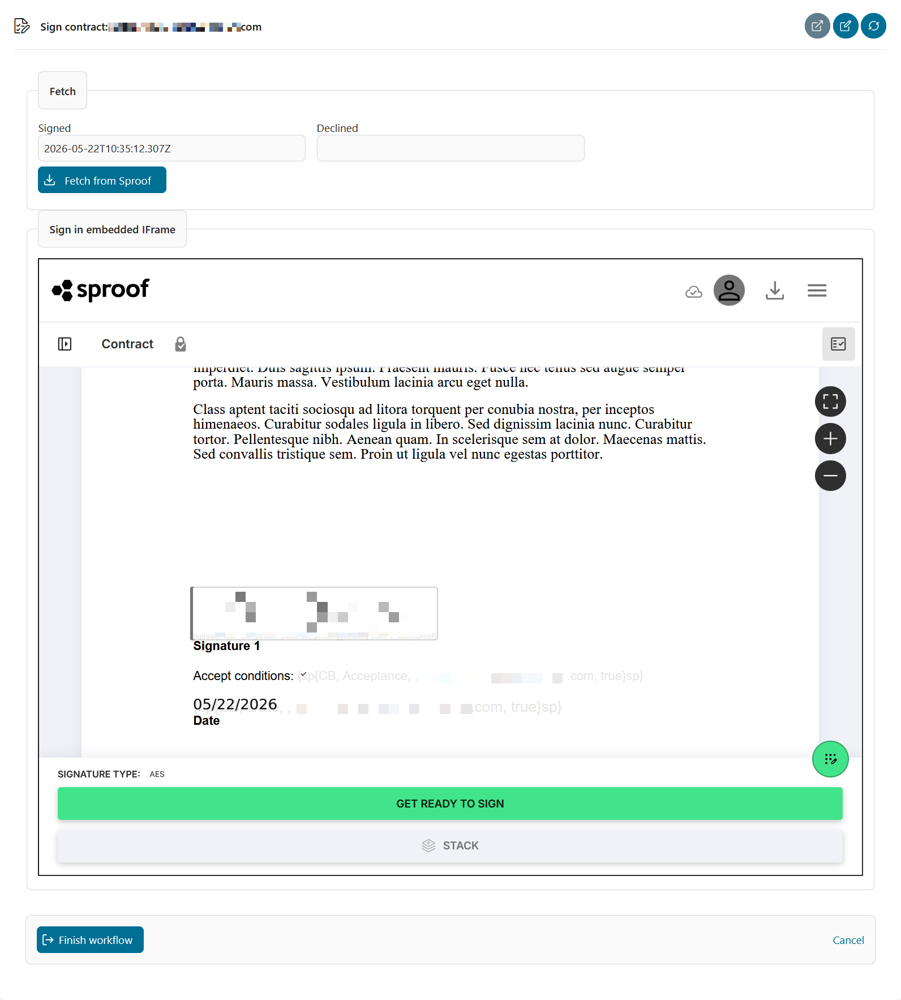

# Sproof Connector

Sproof is a modern digital signature solution coming from Austria. This connector provides integration between Sproof and AxonIvy.

The Sproof API is published as a REST solution and integrated into Ivy as a REST client. The connector provides the API as-is to avoid imposing any unwanted restrictions on the API. A demo shows two simple variations of a typical signature workflow. As described later, additional calls may require minor adjustments to the connector.


## Demo

### Signature on static or dynamic document

The demo UI is designed to fit on a single page, providing a simple signature solution where a document is created, a signature request is sent to Sproof, and the signature status and content of the document can be checked.



First, enter up to two persons as signers. Each person need a first name, a last name, and an email address. If any of these informations is missing, the person will be ignored in this demo for the sake of simplicity. __Please note, that Sproof will send signature requests to the provided email addresses!__

The demo shows a static and a dynamic method for creating signature documents.

Once the document has been created, it can be sent to Sproof for signature with the click of a button. Sending the document initiates the signature process in Sproof, and signers are prompted to sign.

The API provides a so-called `Member Id` for identification, which is displayed in the interface (or can also be entered manually).

Clicking *Fetch* retrieves the current state of the document from Sproof and displays it on the page. (Another option, which is not shown in this demo, is to use a `callbackUrl`, which Sproof will call upon certain events and which could, for example, be connected to a REST service provided by AxonIvy.)

For additional features and information, please refer to the [Sproof API Documentation](https://docs.sproof.com/)!

#### Signatures on a static document

A static document is created, and signers are assigned an absolute, fixed position within the document for their signature. This approach is suitable when the document size is fixed or, more generally, when the absolute position of a signature within the document is known in advance.

#### Signatures on a dynamically generated document

A dynamic document is created that contains placeholders for signers at specific locations. This approach is ideal when documents can vary in size (such as invoices with a variable number of items or contracts with optional sections). In this case, the exact position of a signature within the document is unknown in advance. In this demo, placeholders are shown in light grey so they are easy to see. In productive environments
placeholders can be made invisible.

### Signature task Demo and embedded signing

This demo shows a workflow where a signing task is created for a specific person and then completed either in a new browser tab or directly within in a page via an embedded IFrame.

#### Step 1: Create a signing task

The workflow begins with a *Create signing task* dialog. The initiator enters the signer's first name, last name, and email address, then clicks **Create signing task** to start the process. Sproof will use the provided email address to identify the signer.



#### Step 2: The signer opens the task

Once the task has been created, it appears in the signer's task list. Opening it presents the task *Sign contract* with two choices for how to proceed with the signing:

- **Sign in a new Browser Tab** — the Sproof signing page opens in a separate browser tab.
- **Sign in an embedded IFrame** — the Sproof signing interface is loaded directly inside the AxonIvy task page.



#### Step 3: Signing in the embedded IFrame

When the signer chooses the embedded IFrame option, the Sproof signing interface appears inline within the page. The document is displayed with the signature fields highlighted. A *Fetch from Sproof* button is available above the IFrame to query the current signing status at any time and immediately saves the current version of the document as a case document.



#### Step 4: Filling in the signature fields

Sproof's *Quick access* dialog guides the signer through the required fields. In this demo there are three mandatory fields: the **Signature** itself, an **Acceptance** checkbox, and a **Date**. Fields marked with `*` must be completed before the document can be signed.



#### Step 5: Confirming and submitting the signature

After all three fields have been filled (shown as 3/3 in the Sproof header), the **Continue to Sign** button becomes active. Clicking it submits the signature to Sproof.


#### Step 6: Signature confirmed

Sproof displays a *Thank you for your signature!* confirmation inside the embedded IFrame. From here the signer can go to the Sproof dashboard or download the signed document. Clicking **Close** dismisses the confirmation and returns to the AxonIvy task view.



#### Step 7: Finishing the workflow

After closing the confirmation, the document view inside the IFrame shows the applied signature, the accepted conditions, and the date. Clicking **Fetch from Sproof** in the outer AxonIvy frame refreshes the signing status, displays the timestamp at which the document was signed, and saves the current document as a case document. Clicking **Finish workflow** also fetches the latest document from Sproof, saves it as a case document, and then completes the AxonIvy task.



## Setup

To start the demo, you will need a Sproof API key, as well as the sender's name and email address, which must be defined in global variables (e.g., in the Cockpit). You can request this information directly from Sproof.

```
@variables.yaml@
```

### Development

Sproof does not use the API key in a header field but instead passes it as a `GET` parameter or a JSON attribute, depending on the API call. This connector therefore does not adopt this abstraction but instead provides a service, `com.axonivy.connector.sproof.service.SproofService`, to easily retrieve the relevant data (for most calls, the API key is sufficient).

#### Legacy API

Sproof offers some endpoints in multiple versions (“legacy”). In the specification, the entities used are sometimes distinguished by a leading underscore `_`. This underscore was replaced by the word `Sproof` when the client was generated. Therefore, some entities exist in two variants (e.g., `Document` and `SproofDocument`), and care must be taken to use the correct variant when making REST calls.

Similarly, Sproof does not provide type information for polymorphic objects, which means that differentiation cannot be performed automatically in typed languages (such as Java). For some of the known types, special deserializers were therefore created in a `SproofFeature` to make this decision.

The current implementation of the connector includes only the objects required for the demo. If you need additional ones, you can unpack the connector and add the missing definitions. In this case, we would be pleased to hear about these changes so we can potentially incorporate them into the connector.

Alternatively, in these cases, you always have the option to read results as `JsonNode` (turn off the OpenAPI switch!) and specifically access the fields required for your use case.

#### Client Creation

As described earlier, Sproof’s OpenAPI specification currently contains object names that differ from one another only by a leading underscore. To enable the Client Generator to read these, these underscores have been replaced with the word `Sproof` (as of April 2026). If Sproof maintains this approach, a new version of the specification can be downloaded and “corrected” using the Unix shell script `openapi-correct.sh` (or similar logic). The “corrected” specification `openapi-corrected.json` can then be used directly to generate the REST client.